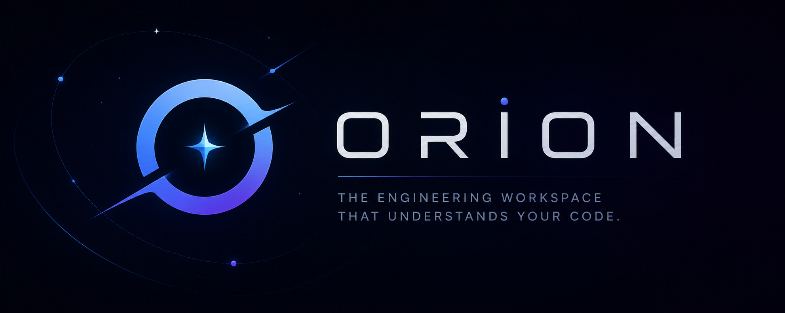

# ORION

> **The Engineering Workspace That Understands Your Code.**

::: {align="center"}


**AI-native. Context-aware. Built for modern software engineering.**

[Features](#features) • [Vision](#vision) • [Roadmap](#roadmap) • [Tech
Stack](#tech-stack) • [Getting Started](#getting-started)
:::

------------------------------------------------------------------------

# 🚀 What is Orion?

Orion is an AI-native engineering workspace designed to eliminate
context switching.

Modern developers constantly jump between:

-   VS Code
-   Postman
-   Database tools
-   Browser documentation
-   Terminal
-   GitHub
-   AI assistants

Each tool knows only a small part of your workflow.

**Orion changes that.**

Instead of isolated tools, Orion provides a single engineering workspace
where every component shares the same understanding of your project.

The result is an environment that doesn't just edit code.

It understands it.

------------------------------------------------------------------------

# ✨ Vision

Imagine asking:

> "Where is authentication handled?"

Instead of searching hundreds of files...

Orion answers.

Imagine testing an API.

Orion already knows:

-   the endpoint
-   the database schema
-   the related models
-   the authentication flow
-   your previous conversation

Imagine opening a new project.

Instead of spending hours understanding the architecture...

Orion explains it in minutes.

------------------------------------------------------------------------

# ⚡ Features

## 🧠 AI Project Intelligence

-   Understand entire repositories
-   Explain project architecture
-   Answer questions about your codebase
-   Locate files instantly
-   Summarize modules
-   Explain complex functions

## 💻 Smart Code Editor

-   Monaco-powered editor
-   Syntax highlighting
-   File explorer
-   AI-assisted editing

## 📊 Project Analysis

-   Detect technologies
-   Dependency visualization
-   Folder overview
-   Architecture summaries
-   Code insights

## 🧰 Integrated Workspace (Planned)

-   Terminal
-   Browser
-   Database Manager
-   API Client
-   Git
-   AI Chat

------------------------------------------------------------------------

# 🗺️ Roadmap

## Version 0.1 (Current)

-   [x] Desktop Workspace
-   [x] Project Explorer
-   [x] Monaco Editor
-   [x] AI Chat
-   [x] Project Overview
-   [x] Architecture Generation

## Version 0.2

-   [ ] Git Integration
-   [ ] Workspace Memory
-   [ ] Local Search
-   [ ] File Relationships

## Version 0.3

-   [ ] API Client
-   [ ] Browser
-   [ ] Database Viewer
-   [ ] SQL Assistant

## Version 0.4

-   [ ] Docker Integration
-   [ ] Deployment Manager
-   [ ] Cloud Sync

## Version 1.0

-   [ ] Multi-agent AI
-   [ ] Team Collaboration
-   [ ] Plugin Marketplace

------------------------------------------------------------------------

# 🛠 Tech Stack

### Desktop

-   Tauri
-   React
-   TypeScript
-   Tailwind CSS
-   shadcn/ui

### Backend

-   FastAPI
-   Python

### AI

-   OpenAI
-   Claude
-   Gemini

### Editor

-   Monaco Editor

### Database

-   SQLite
-   PostgreSQL

------------------------------------------------------------------------

# 📂 Project Structure

``` text
orion/
├── frontend/
├── backend/
├── assets/
├── docs/
├── scripts/
├── README.md
└── LICENSE
```

------------------------------------------------------------------------

# 💡 Philosophy

Software engineering shouldn't feel like juggling ten disconnected
applications.

Your editor should understand your database.

Your AI should understand your project.

Your API client should understand your backend.

Your tools should work together.

**Orion isn't another AI coding assistant. It's an engineering workspace
where every tool shares the same understanding of your project.**

------------------------------------------------------------------------

# 🤝 Contributing

Contributions, feature requests, and discussions are welcome.

------------------------------------------------------------------------

# 📜 License

MIT License

------------------------------------------------------------------------

::: {align="center"}
## ORION

**The Engineering Workspace That Understands Your Code.**

*Build software, not context.*
:::
